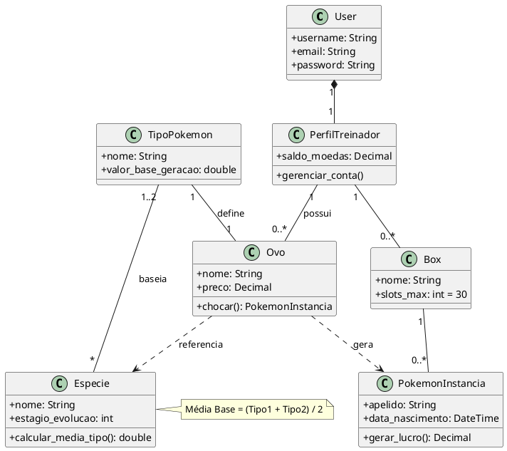
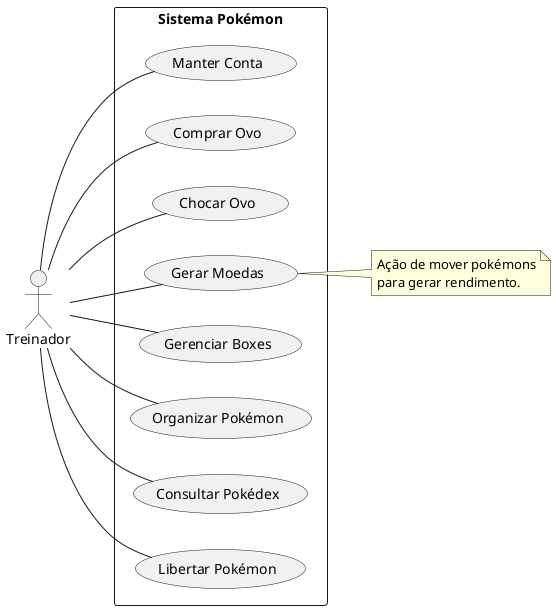

# 📑 System Context: PokéSystem (Django Project)

## 1. Project Identity
* **Core Objective:** A Pokémon collection and passive income simulator.
* **Tech Stack:** Django 5.x, Bootstrap 5, HTMX, PokéAPI.
* **Architecture:** Model-Template-View (MTV) with a focus on Object-Oriented Logic for status calculation.

## 2. Entity Definition & Data Schema

### 2.1. Static Data (Game Definitions)
* **`TipoPokemon`**: Defines the elemental base value ($V_{tipo}$).
    * *Values:* S Tier (20), A Tier (15), B Tier (10), C Tier (5).
* **`Especie`**: Static template for a Pokémon (from PokéAPI).
    * *Fields:* `name`, `base_stats_total (BST)`, `evolution_stage` (1, 2, or 3), `has_evolution` (bool).
    * *Rarity Class ($V_{raridade}$):* Derived from BST of the final evolution form.

### 2.2. Dynamic Data (User Instances)
* **`PerfilTreinador`**: Extension of the `User` model. Stores `balance`.
* **`Ovo`**: Linking entity. Maps 1 `TipoPokemon` to 1 or more `Especie`.
* **`PokemonInstancia`**: The specific record owned by the user.
    * *Fields:* `nickname`, `box_id`, `species_id`, `is_active_team` (bool).
* **`Box`**: Container for `PokemonInstancia`. Limit: 30 slots.

---

## 3. Algorithmic Logic (Business Rules)

### 3.1. Species Base Value ($V_{base}$)
Defined by the average of the type values associated with the species.
$$V_{base} = \frac{\sum V_{tipo}}{n} \quad \text{where } n \in \{1, 2\}$$

### 3.2. Rarity Mapping ($V_{raridade}$)
Based on the Base Stats Total (BST) of the species' final form:
* **Common ($V_{raridade} = 1$):** $BST < 420$
* **Rare ($V_{raridade} = 2$):** $420 \le BST < 520$
* **Epic ($V_{raridade} = 3$):** $520 \le BST < 580$
* **Legendary ($V_{raridade} = 4$):** $BST \ge 580$

### 3.3. Income Generation ($G_{moeda}$)
Hourly profit generated when `PokemonInstancia.is_active_team` is `True`.

* **Evolutionary Line:** $G_{moeda} = V_{base} \times V_{raridade} \times V_{evolucao}$
* **Single Stage (No Evolution):** $G_{moeda} = V_{base} \times V_{raridade} \times 2$

---

## 4. Technical Constraints (UI/UX)

* **View Requirements:** Must use Django Generic Views (`CreateView`, `UpdateView`, `DeleteView`, `DetailView`).
* **Interaction Model:** Use **Modals via HTMX** for CRUD operations on Pokémon instances.
* **Visual Identity:** * Primary: `#EE1515` (Red), `#FFCC00` (Yellow).
    * Layout: Fixed Navbar, Full-screen content, Sticky Footer.
    * Structure: Dashboard displays "Boxes" in center and "Active Team" slots at the bottom.

---

## 5. PlantUML Diagrams

### 5.1. Class Diagram

### 5.2. Use Case Diagram
